# Linux Builder Engine - Implementation Plan

## Executive Summary

This document outlines the complete system design and implementation plan for integrating the enhanced Modelfile schema (114 keywords, 25 categories) into the Linux Builder Engine backend.

**Goal:** Transform natural language OS build prompts into fully functional, bootable Linux ISOs.

**Current State:** Basic schema supporting 4 distros, limited package installation.

**Target State:** Full schema supporting 8 distros, security hardening, AI/ML packages, services, encryption, and customization.

---

## Table of Contents

1. [System Architecture](#1-system-architecture)
2. [Component Design](#2-component-design)
3. [Data Flow](#3-data-flow)
4. [Schema Design](#4-schema-design)
5. [Build Pipeline](#5-build-pipeline)
6. [Implementation Phases](#6-implementation-phases)
7. [Package Resolution](#7-package-resolution)
8. [Security Configuration](#8-security-configuration)
9. [Error Handling](#9-error-handling)
10. [API Reference](#10-api-reference)

---

## 1. System Architecture

### 1.1 High-Level Architecture

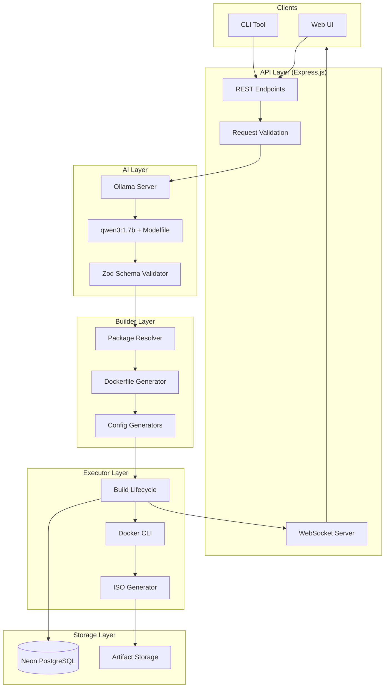

### 1.2 Technology Stack

| Layer | Technology | Purpose |
|-------|------------|---------|
| Runtime | Node.js (LTS) | Server runtime |
| Language | TypeScript | Type safety |
| Framework | Express.js | REST API |
| Database | Neon PostgreSQL | Serverless DB |
| ORM | Prisma | Database access |
| Validation | Zod | Schema validation |
| AI | Ollama + qwen3:1.7b | Prompt parsing |
| Containers | Docker CLI | Image building |
| WebSocket | ws | Real-time updates |

### 1.3 Directory Structure

```
src/
├── index.ts                 # Entry point
├── api/
│   └── build.controller.ts  # REST endpoints
├── ai/
│   └── schema.ts            # Zod schemas (EXPAND)
├── builder/
│   ├── dockerfileGenerator.ts  # Dockerfile creation (EXPAND)
│   ├── isoGenerator.ts         # ISO creation (EXPAND)
│   └── packageMaps.ts          # NEW: Package mappings
├── executor/
│   └── lifecycle.ts         # Build orchestration (EXPAND)
├── utils/
│   ├── sanitizer.ts         # Input sanitization
│   ├── packages.ts          # Package utilities
│   ├── securityConfig.ts    # NEW: Security configs
│   ├── serviceConfig.ts     # NEW: Service configs
│   └── shellConfig.ts       # NEW: Shell configs
├── ws/
│   └── index.ts             # WebSocket server
└── db/
    └── index.ts             # Prisma client
```

---

## 2. Component Design

### 2.1 Component Interaction

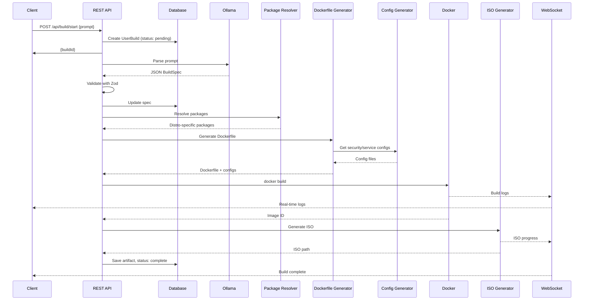

### 2.2 Component Responsibilities

| Component | Responsibility |
|-----------|----------------|
| REST API | Request handling, routing, response formatting |
| Zod Schema | Input validation, type inference |
| Ollama | NL prompt → JSON conversion |
| Package Resolver | Abstract package → distro-specific mapping |
| Dockerfile Generator | Create Dockerfiles per distro |
| Config Generators | Security, service, shell configurations |
| Build Lifecycle | Orchestrate build steps, error handling |
| Docker CLI | Execute docker build commands |
| ISO Generator | Create bootable ISOs from images |
| WebSocket | Real-time progress streaming |
| Prisma | Database operations |


---

## 3. Data Flow

### 3.1 Request Flow

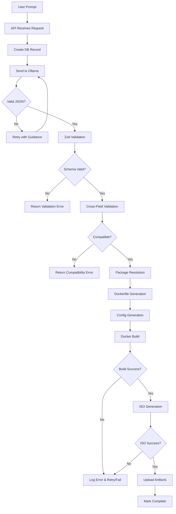

### 3.2 Data Transformation Pipeline

```
┌─────────────────┐     ┌─────────────────┐     ┌─────────────────┐
│  Natural Lang   │     │   Structured    │     │    Resolved     │
│     Prompt      │ ──▶ │      JSON       │ ──▶ │      Spec       │
│                 │     │   (BuildSpec)   │     │  (with distro   │
│ "Arch-based,    │     │ {base: "arch",  │     │   packages)     │
│  hyprland..."   │     │  display:...}   │     │                 │
└─────────────────┘     └─────────────────┘     └─────────────────┘
        │                       │                       │
        ▼                       ▼                       ▼
    [Ollama]              [Zod Schema]          [Package Resolver]
                                                        │
                                                        ▼
┌─────────────────┐     ┌─────────────────┐     ┌─────────────────┐
│   ISO Artifact  │     │  Docker Image   │     │   Dockerfile    │
│                 │ ◀── │                 │ ◀── │   + Configs     │
│  bootable.iso   │     │  linux-build:x  │     │                 │
└─────────────────┘     └─────────────────┘     └─────────────────┘
        │                       │                       │
        ▼                       ▼                       ▼
   [ISO Generator]         [Docker CLI]        [Dockerfile Gen]
```

---

## 4. Schema Design

### 4.1 BuildSpec Class Diagram

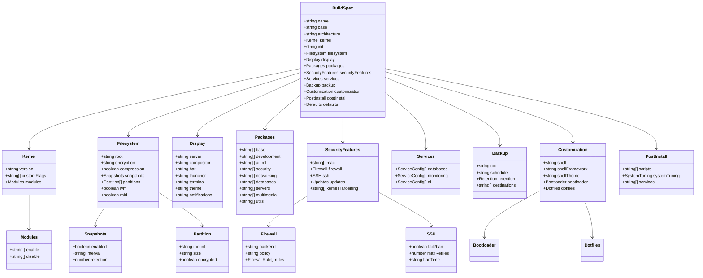

### 4.2 Supported Values

| Field | Valid Values |
|-------|--------------|
| base | arch, debian, ubuntu, alpine, fedora, opensuse, void, gentoo |
| architecture | x86_64, aarch64 |
| kernel.version | linux-lts, linux-zen, linux-hardened |
| init | systemd, openrc, runit, s6 |
| filesystem.root | ext4, btrfs, xfs, zfs |
| filesystem.encryption | luks1, luks2, null |
| display.server | wayland, xorg, null |
| display.compositor | hyprland, sway, i3, gnome, kde, xfce, dwm, bspwm |
| securityFeatures.mac | apparmor, selinux |
| securityFeatures.firewall.backend | nftables, iptables, ufw |
| customization.shell | zsh, bash, fish |
| backup.tool | borg, restic |

### 4.3 Cross-Field Validation Rules

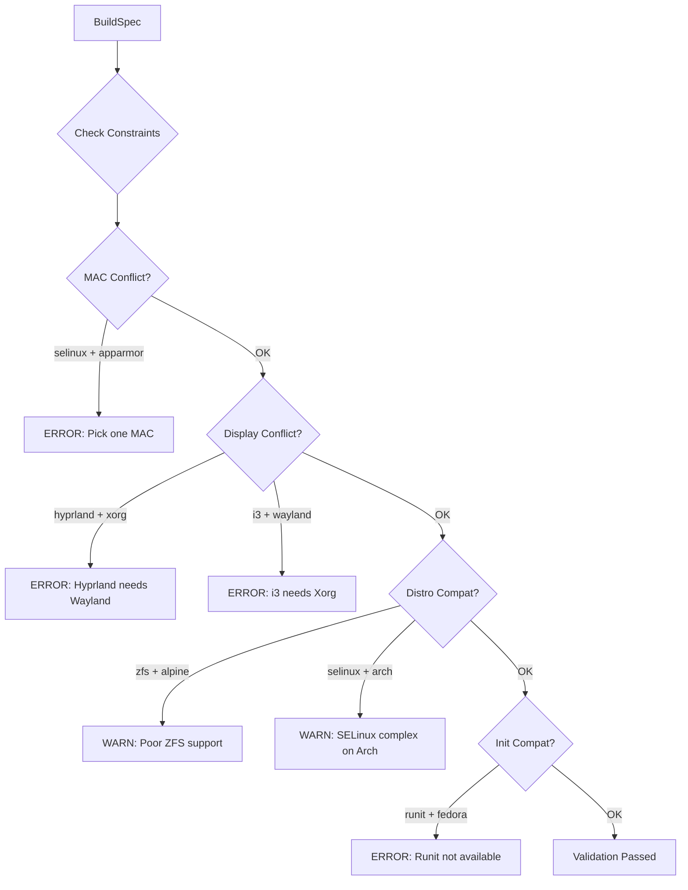


---

## 5. Build Pipeline

### 5.1 Pipeline Stages

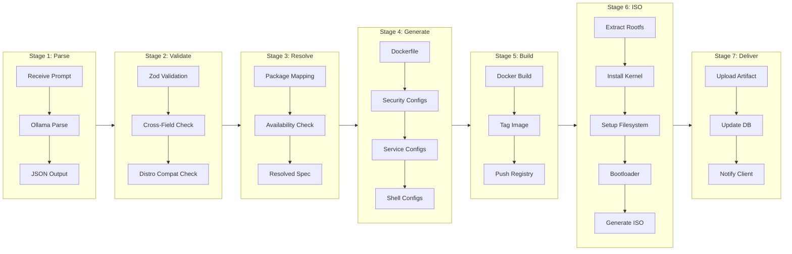

### 5.2 Dockerfile Generation Flow

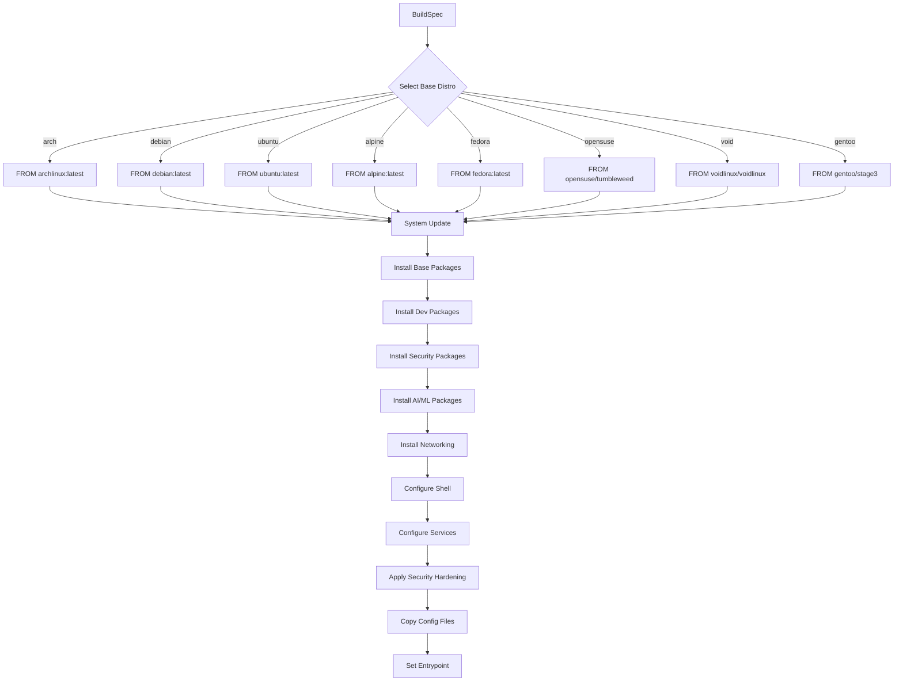

### 5.3 ISO Generation Flow

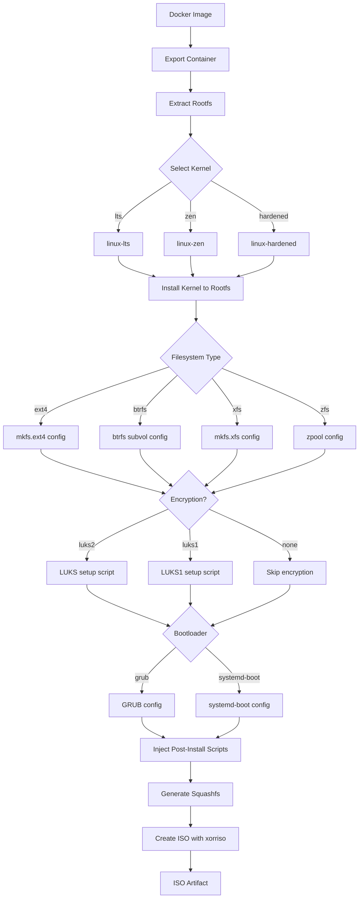

### 5.4 Build Status States

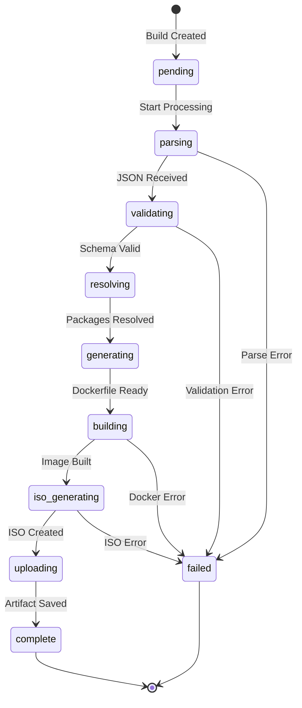


---

## 6. Implementation Phases

### 6.1 Phase Overview

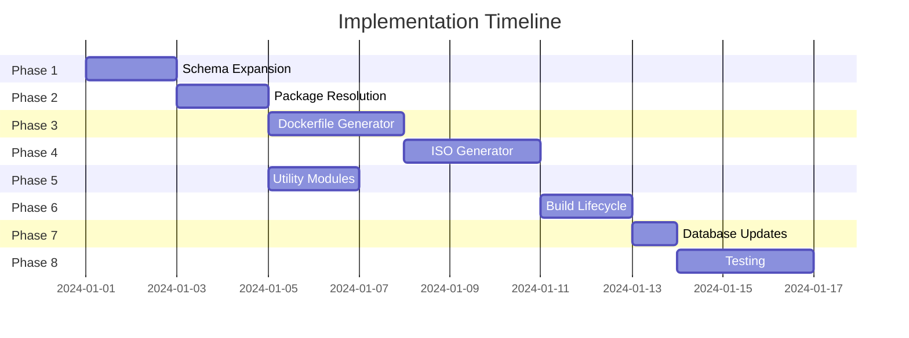

### 6.2 Phase 1: Schema Expansion

**File:** `src/ai/schema.ts`

**Tasks:**
1. Add base distro enum (8 distros)
2. Add kernel schema with version, flags, modules
3. Add filesystem schema with encryption, snapshots
4. Expand securityFeatures with firewall, SSH, MAC
5. Add packages object with categories
6. Add services schema for databases, monitoring, AI
7. Add backup schema
8. Add customization schema (shell, bootloader, dotfiles)
9. Add postInstall schema
10. Implement cross-field validation

**Deliverables:**
- Expanded Zod schema matching Modelfile output
- Type exports for all new interfaces
- Validation error messages

---

### 6.3 Phase 2: Package Resolution

**New File:** `src/builder/packageMaps.ts`

**Tasks:**
1. Create package manager mapping per distro
2. Create abstract → distro package mapping (100+ packages)
3. Create package availability matrix
4. Implement resolution function with warnings
5. Handle special packages (AUR, PPAs, etc.)

**Package Manager Map:**
```typescript
const PACKAGE_MANAGERS = {
  arch:     { install: "pacman -S --noconfirm", update: "pacman -Syu --noconfirm" },
  debian:   { install: "apt-get install -y",    update: "apt-get update" },
  ubuntu:   { install: "apt-get install -y",    update: "apt-get update" },
  alpine:   { install: "apk add --no-cache",    update: "apk update" },
  fedora:   { install: "dnf install -y",        update: "dnf update -y" },
  opensuse: { install: "zypper install -y",     update: "zypper refresh" },
  void:     { install: "xbps-install -y",       update: "xbps-install -Su" },
  gentoo:   { install: "emerge",                update: "emerge --sync" }
};
```

**Deliverables:**
- Package mapping for all 114 keywords
- Resolution function returning distro-specific packages
- Warnings for unavailable packages

---

### 6.4 Phase 3: Dockerfile Generator Expansion

**File:** `src/builder/dockerfileGenerator.ts`

**Tasks:**
1. Add Fedora generator (dnf)
2. Add OpenSUSE generator (zypper)
3. Add Void generator (xbps)
4. Add Gentoo generator (emerge with binpkgs)
5. Refactor to use package resolver
6. Add security package installation
7. Add shell customization steps
8. Add service configuration per init system
9. Add config file copying

**Generator Structure:**
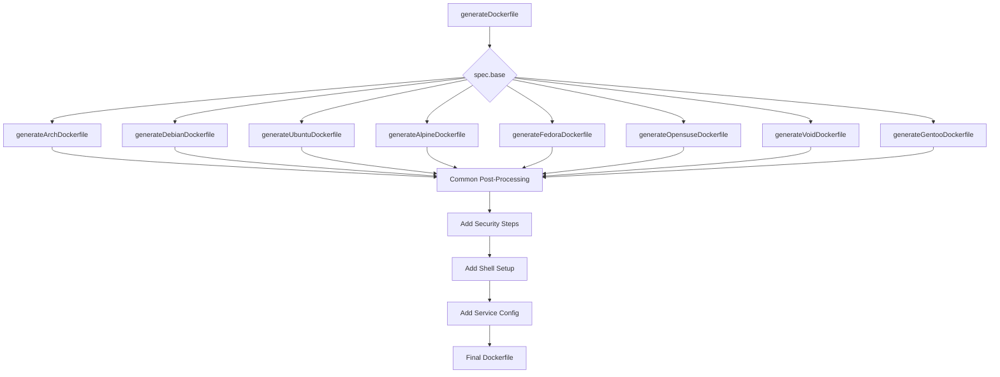

---

### 6.5 Phase 4: ISO Generator Enhancement

**File:** `src/builder/isoGenerator.ts`

**Tasks:**
1. Add kernel selection per distro
2. Add filesystem setup scripts
3. Add LUKS encryption setup
4. Add btrfs subvolume creation
5. Add bootloader configuration (GRUB/systemd-boot)
6. Add post-install script injection
7. Add Plymouth splash support

**Kernel Packages:**
```typescript
const KERNELS = {
  arch:   { lts: "linux-lts", zen: "linux-zen", hardened: "linux-hardened" },
  debian: { lts: "linux-image-amd64" },
  ubuntu: { lts: "linux-image-generic" },
  fedora: { lts: "kernel" },
  alpine: { lts: "linux-lts" },
  void:   { lts: "linux" },
  gentoo: { lts: "gentoo-kernel-bin" }
};
```

---

### 6.6 Phase 5: Utility Modules

**New Files:**

**`src/utils/securityConfig.ts`**
- `generateFirewallRules(spec)` → nftables/iptables config
- `generateFail2banConfig(spec)` → jail.local
- `generateSSHConfig(spec)` → sshd_config
- `generateAppArmorProfile(spec)` → basic profiles

**`src/utils/serviceConfig.ts`**
- `getEnableCommand(service, init)` → enable command per init
- `getDisableCommand(service, init)` → disable command
- `generateServiceConfig(service)` → config files

**`src/utils/shellConfig.ts`**
- `generateZshSetup(spec)` → oh-my-zsh install
- `generateStarshipConfig(spec)` → starship.toml
- `generateShellRc(spec)` → .zshrc/.bashrc

---

### 6.7 Phase 6: Build Lifecycle Updates

**File:** `src/executor/lifecycle.ts`

**Tasks:**
1. Add new build steps enum
2. Add validation step with cross-field checks
3. Add package resolution step
4. Add config generation step
5. Enhance progress reporting
6. Add detailed error messages
7. Update artifact metadata

**Build Steps:**
```typescript
enum BuildStep {
  PENDING = "pending",
  PARSING = "parsing",
  VALIDATING = "validating",
  RESOLVING = "resolving",
  GENERATING = "generating",
  BUILDING = "building",
  ISO_GENERATING = "iso_generating",
  UPLOADING = "uploading",
  COMPLETE = "complete",
  FAILED = "failed"
}
```

---

### 6.8 Phase 7: Database Updates

**File:** `prisma/schema.prisma`

**Tasks:**
1. Add new fields to UserBuild model
2. Create migration
3. Update Prisma client

**New Fields:**
```prisma
model UserBuild {
  // Existing fields...
  
  // New fields
  baseDistro     String?
  kernelVersion  String?
  initSystem     String?
  securityLevel  String?   // minimal, standard, hardened
  featuresJson   Json?     // Full expanded spec
  buildDuration  Int?      // Seconds
  warnings       String[]  // Build warnings
}
```

---

### 6.9 Implementation Dependencies

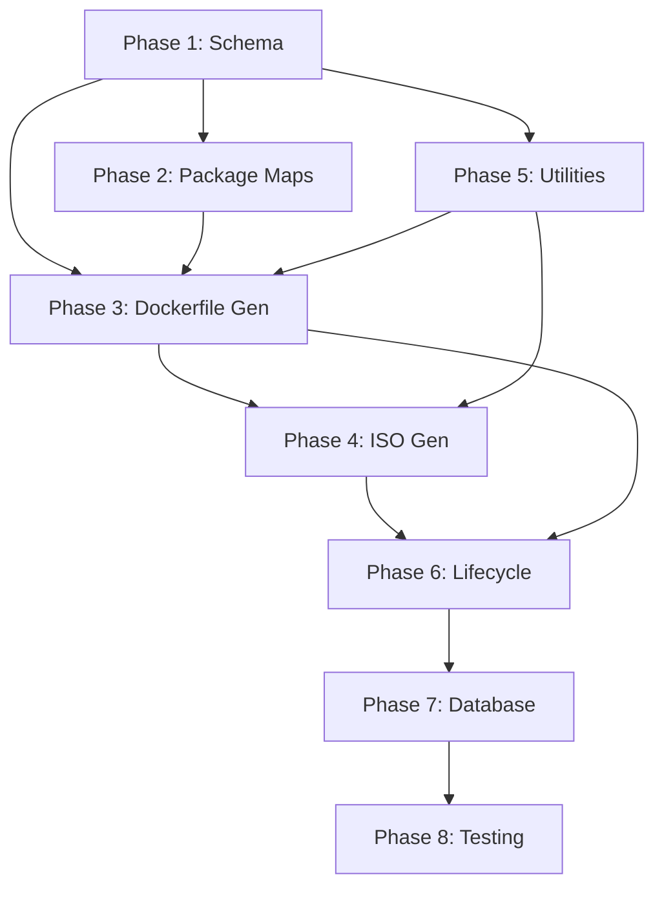


---

## 7. Package Resolution

### 7.1 Resolution Flow

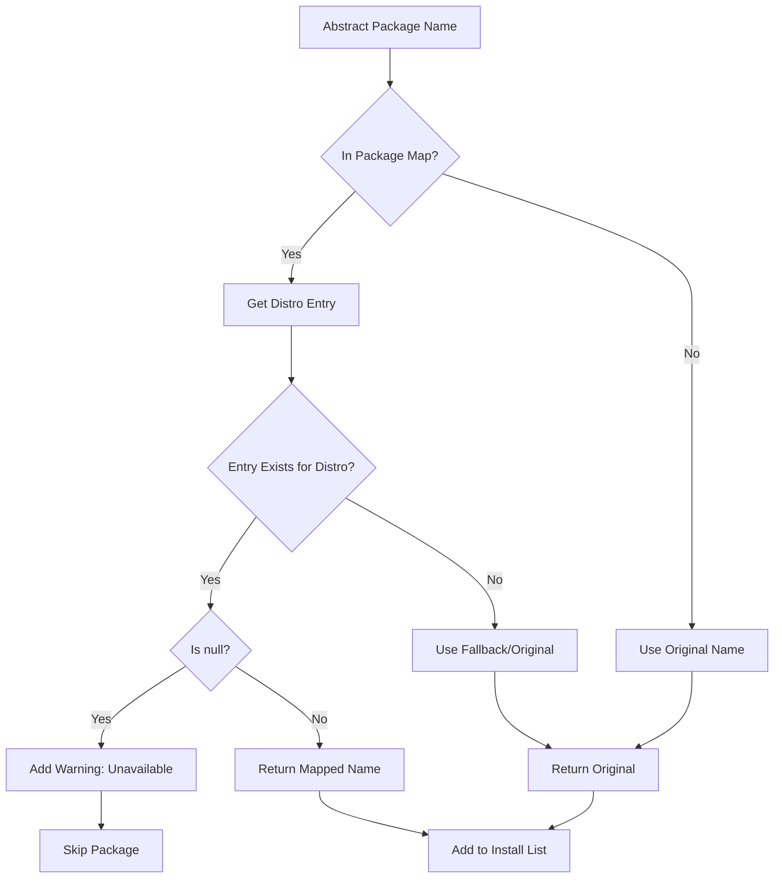

### 7.2 Package Categories

| Category | Example Packages | Count |
|----------|------------------|-------|
| development | docker, git, python, nodejs, rust, go | 20 |
| ai_ml | cuda, pytorch, tensorflow, ollama, jupyter | 12 |
| security | apparmor, selinux, nftables, fail2ban | 16 |
| networking | networkmanager, wireguard, tailscale | 10 |
| databases | postgresql, mysql, redis, mongodb | 6 |
| servers | nginx, apache, caddy | 4 |
| multimedia | ffmpeg, pipewire, gstreamer | 8 |
| utils | yay, flatpak, neofetch | 10 |

### 7.3 Sample Package Mappings

```typescript
// Development packages
docker:    { arch: "docker", debian: "docker.io", fedora: "docker-ce", alpine: "docker" }
nodejs:    { arch: "nodejs", debian: "nodejs", fedora: "nodejs", alpine: "nodejs" }
python:    { arch: "python", debian: "python3", fedora: "python3", alpine: "python3" }
rust:      { arch: "rust", debian: "rustc", fedora: "rust", alpine: "rust" }

// Security packages  
apparmor:  { arch: "apparmor", debian: "apparmor", ubuntu: "apparmor", fedora: null }
selinux:   { arch: null, debian: "selinux-basics", fedora: "selinux-policy" }
nftables:  { arch: "nftables", debian: "nftables", fedora: "nftables", alpine: "nftables" }

// AI/ML packages
cuda:      { arch: "cuda", debian: "nvidia-cuda-toolkit", ubuntu: "nvidia-cuda-toolkit" }
pytorch:   { arch: "python-pytorch-cuda", debian: "python3-torch", ubuntu: "python3-torch" }
```


---

## 8. Security Configuration

### 8.1 Security Stack Flow

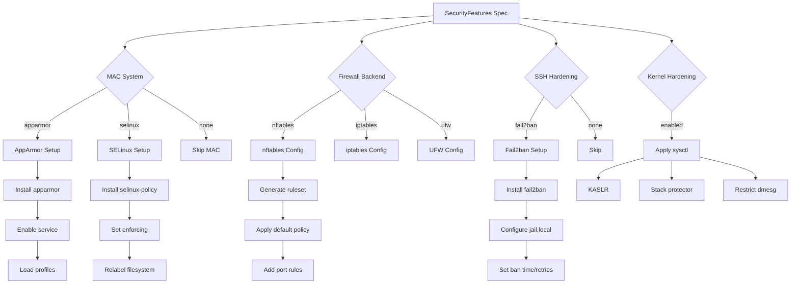

### 8.2 Firewall Rule Generation

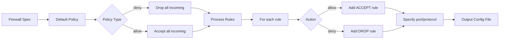

### 8.3 Security Levels

| Level | Features Enabled |
|-------|------------------|
| minimal | Basic firewall only |
| standard | Firewall + fail2ban + auto-updates |
| hardened | MAC + firewall + fail2ban + kernel hardening + encryption |


---

## 9. Error Handling

### 9.1 Error Categories

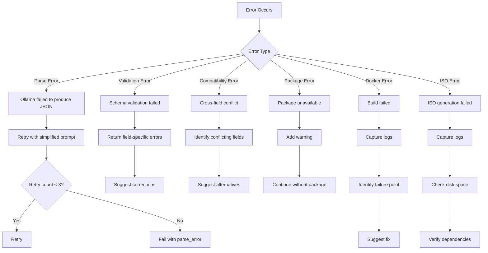

### 9.2 Error Response Format

```typescript
interface BuildError {
  code: string;           // e.g., "VALIDATION_ERROR"
  message: string;        // Human-readable message
  field?: string;         // Which field caused error
  suggestion?: string;    // How to fix
  details?: object;       // Additional context
}
```

### 9.3 Common Errors

| Code | Cause | Resolution |
|------|-------|------------|
| PARSE_ERROR | Ollama output invalid JSON | Retry or simplify prompt |
| VALIDATION_ERROR | Schema mismatch | Check field values |
| COMPAT_ERROR | Conflicting options | Remove one option |
| PKG_UNAVAILABLE | Package not in distro | Use alternative |
| DOCKER_BUILD_FAIL | Dockerfile error | Check logs |
| ISO_GEN_FAIL | ISO tools failed | Check dependencies |

---

## 10. API Reference

### 10.1 Endpoints

#### POST /api/build/start

Start a new build from prompt or spec.

**Request:**
```json
{
  "prompt": "Arch-based, hyprland, security-hardened...",
  // OR
  "spec": { "base": "arch", ... }
}
```

**Response:**
```json
{
  "buildId": "clx1234567890",
  "status": "pending",
  "createdAt": "2024-01-01T00:00:00Z"
}
```

#### GET /api/build/status/:id

Get build status and progress.

**Response:**
```json
{
  "id": "clx1234567890",
  "status": "building",
  "step": "docker_build",
  "progress": 65,
  "logs": ["Installing packages...", "..."],
  "warnings": ["Package X unavailable, skipped"],
  "spec": { ... }
}
```

#### GET /api/build/artifact/:id

Get artifact download URL.

**Response:**
```json
{
  "id": "clx1234567890",
  "type": "iso",
  "url": "https://storage.example.com/builds/xxx.iso",
  "size": 1073741824,
  "checksum": "sha256:abc123..."
}
```

### 10.2 WebSocket Events

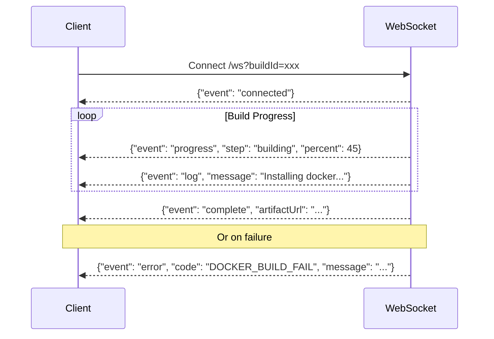

---

## 11. File Changes Summary

| File | Action | Description |
|------|--------|-------------|
| `src/ai/schema.ts` | MODIFY | Expand BuildSpec schema |
| `src/builder/packageMaps.ts` | CREATE | Package resolution maps |
| `src/builder/dockerfileGenerator.ts` | MODIFY | Add 4 distros, refactor |
| `src/builder/isoGenerator.ts` | MODIFY | Kernel, encryption, bootloader |
| `src/utils/securityConfig.ts` | CREATE | Security config generators |
| `src/utils/serviceConfig.ts` | CREATE | Service config generators |
| `src/utils/shellConfig.ts` | CREATE | Shell setup generators |
| `src/executor/lifecycle.ts` | MODIFY | New build steps |
| `prisma/schema.prisma` | MODIFY | New UserBuild fields |

---

## 12. Success Metrics

- [ ] All 8 base distros build successfully
- [ ] All 114 keywords map to correct JSON fields
- [ ] Cross-field validation catches all conflicts
- [ ] Security hardening applies correctly
- [ ] ISO boots and installs successfully
- [ ] Build completes in < 15 minutes (non-Gentoo)
- [ ] WebSocket provides real-time updates
- [ ] Error messages are actionable

---

## Appendix A: Full Keyword Reference

See `Modelfile` for complete keyword taxonomy (114 keywords, 25 categories).

## Appendix B: Package Mapping Table

Full package mappings will be in `src/builder/packageMaps.ts`.

---

*Document Version: 1.0*
*Last Updated: 2024*
